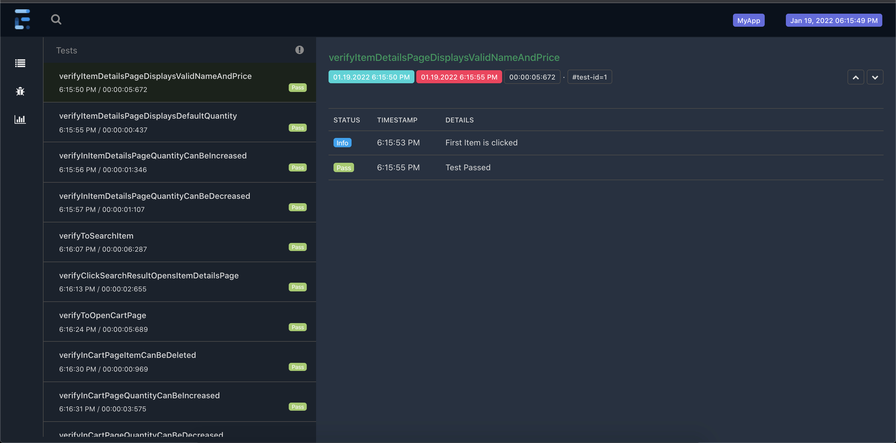

# Gorillas QA Automation Project

This repo is the **Maven-Appium-Java** automation for the Gorillas QA Automation Project. Below have mentioned all the prerequisite and installation to run this tests.

### Please refer to the video under  folder "Video/Execution-Video.mp4"to understand how the test executes and how the report is displayed

## Prerequisite
- Java need to be installed and environment variables need to be set.
- Appium
- Android Emulator

## Clone the Project

- In Terminal/Command prompt type the following
>git clone https://github.com/vignesh1810/Gorillas-QA-Automation.git

- And open the repo in any IDE

## Maven Dependency download
- Once the repo is opened in the IDE → To install all the dependencies mentioned in the pom.xml type the following
> mvn dependency:resolve
- Or other easy way is to click on the "Reload all maven project" button near to maven sidebar in the IntelliJ as shown in the below image    
  

## To run Test and view Reports
- Added 4 tests → Three HappyPath tests and one negative test(To display the failed screenshot in report)
- Right-click on the **testng.xml** and click on **Run../testng.xml**
- Once the test execution is completed open report from folder **Reports/ExtentReport.html**    
  

## Project Folder Structure
Used Maven Project for this automation. Below is the folder structure and each file usage to the framework

### Under src/main/java
- FrameworkConstants → Use to hold constants used across framework
- TestStringConstants → Use to hold constants used in the test for assertions
- Driver → To initiate and quit driver during test execution
- Driver Manager → To manage Driver instance to support **parallel execution**
- Driver Factory → To hold the logic of what driver to launch based on desired capabilities
- Listener → A class which is being listened by testng.xml which helps to trigger various action based on Test Start, Test End, Test Fails etc
- Pages → Hold different page classes. Each class contains locators and method oriented to that class
- Extent Report → To initiate and quit driver Extent Report during test execution
- Utils → As the name suggest used to hold classes which are utilities to the framework such as utility class for Reading Property file, Scrolling, AppInteractions, Starting/Stopping Appium Server

### Under src/test/java
- BaseTest → As the name suggest, this is the base test to all the tests. It helps to initiate and tearDown the test. All tests should extend this Base Test
- ItemDetailsTest → To test & verify the Item Details page. It verifies Item Name, Price, Default  quantity & Item quantity Increase/Decrease
- ItemDetailsTest → To test & verify the Item Details page. It verifies Item Name, Price, Default  quantity & Item quantity Increase/Decrease
- MyCartTest → To test & verify the My Cart page. It verifies Item Name, Price, Default quantity & Item quantity Increase/Decrease
- SearchItemTest → To test & verify the Search page. It verifies item can be searched with given text
- FailedTest → Negative test which will fail as to display the screenshot in the report

### Under src/test/resources
- Config.properties → Hold the important configuration such as Url, Browser